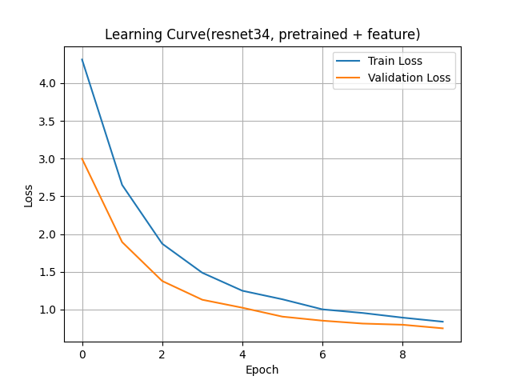
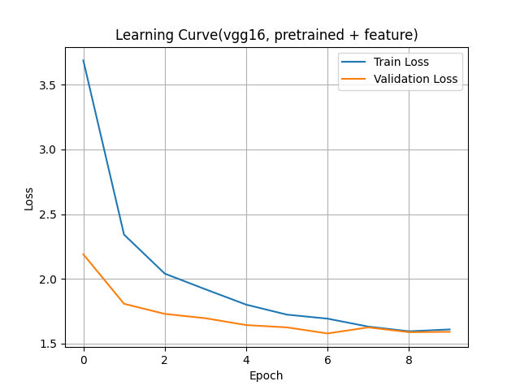
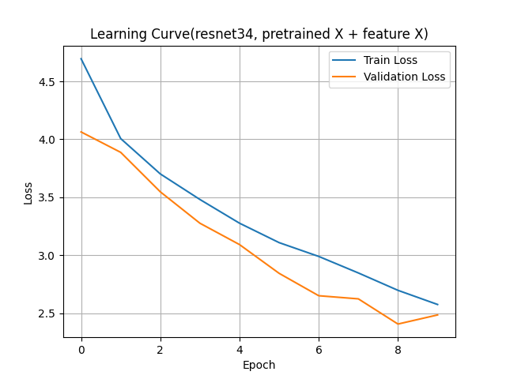
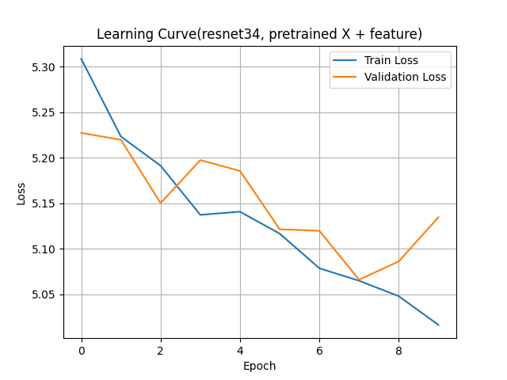
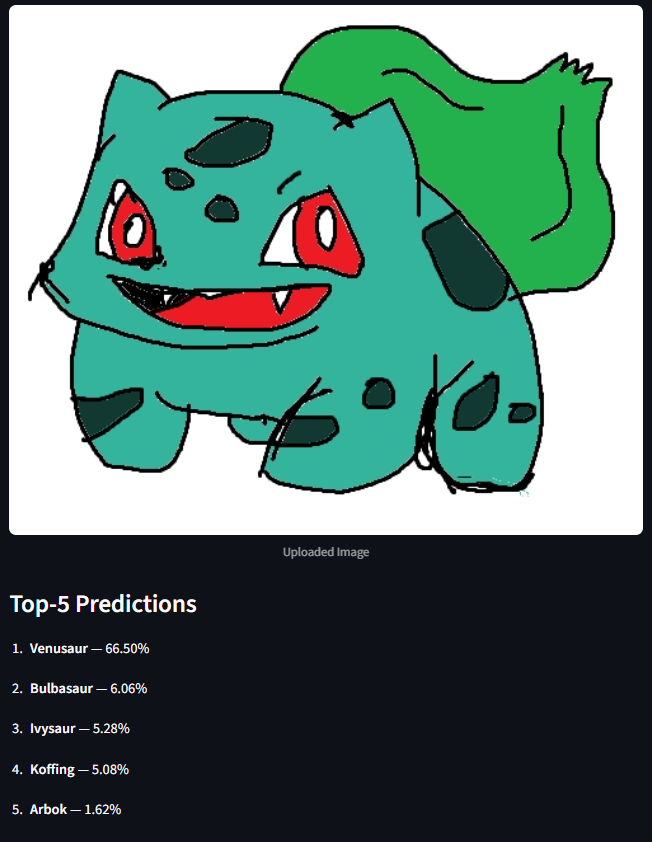
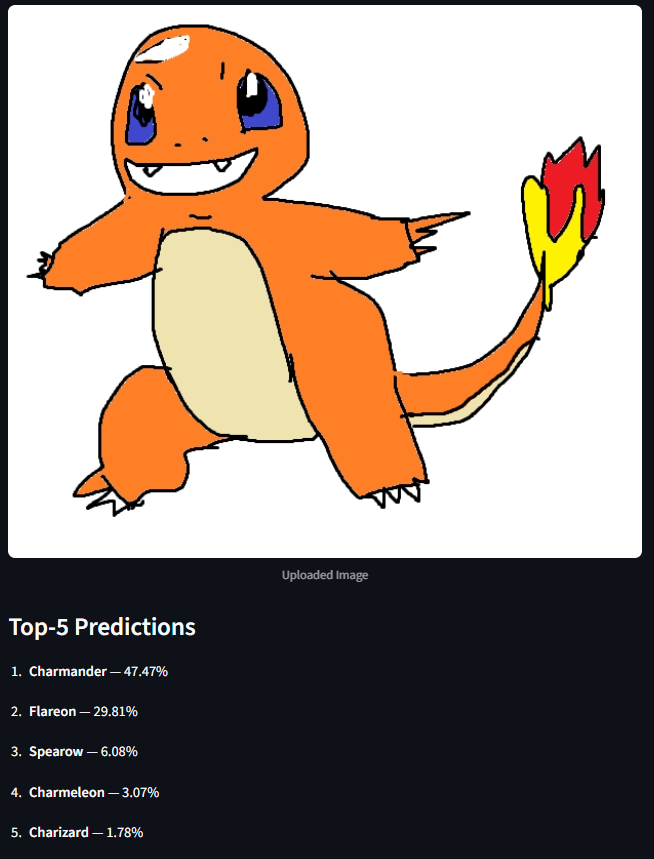
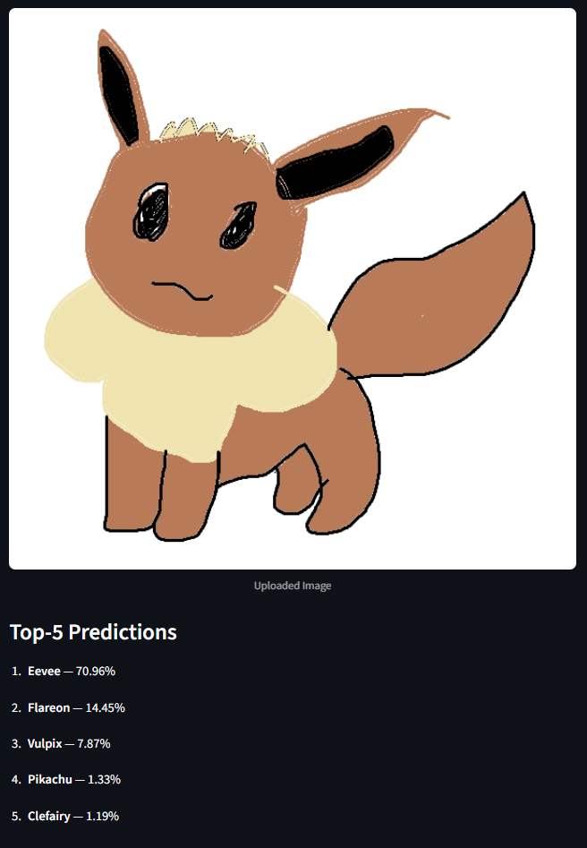
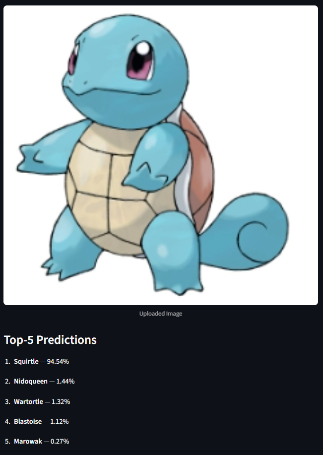

# Pokemon Classification

This project aims to classify Pokemon images using Transfer Learning.

## Dataset (from [Kaggle](https://www.kaggle.com/datasets/lantian773030/pokemonclassification))

- Dataset: PokemonData
- Number of classes: 150
- Total images: approximately 7000

---

## Training Configuration

- Data split: Train 80% / Validation 20%
- Input size: 224 × 224
- Batch Size: 32  
- Epochs: 10  
- Optimizer: Adam  
- Learning Rate: 0.001  
- Loss Function: CrossEntropyLoss  
- Evaluation Metrics: Precision, Recall  

Data preprocessing:
- Train: RandomResizedCrop, RandomHorizontalFlip
- Validation: Resize, CenterCrop

---

## Experiments

Four different configurations were tested.

| Experiment | Model | Pretrained | Feature Extract |
|---|---|---|---|
| 1 | ResNet34 | True | True |
| 2 | ResNet34 | False | True |
| 3 | ResNet34 | False | False |
| 4 | VGG16 | True | True |

---

## Results

| Model | Setting | Precision | Recall |
|---|---|---:|---:|
| ResNet34 | pretrained + feature | 0.8401 | 0.8160 |
| VGG16 | pretrained + feature | 0.6640 | 0.6237 |
| ResNet34 | pretrained X + feature X | 0.3771 | 0.3592 |
| ResNet34 | pretrained X + feature | 0.0141 | 0.0220 |

- Best performing model: **ResNet34 (pretrained + feature extraction)**
- Worst performing model: ResNet34 (pretrained X + feature extraction)

---

## Learning Curve

### ResNet34 (pretrained + feature)


### VGG16 (pretrained + feature)


### ResNet34 (pretrained X + feature X)


### ResNet34 (pretrained X + feature)


---

## Analysis

- ResNet34 showed better performance than VGG16.
- Models using pretrained weights achieved higher performance.  
  (Since the dataset is relatively small, using a pretrained model and fine-tuning with local data leads to better results.)
- Using feature extraction without pretrained weights resulted in very poor performance.  
  (Feature extraction assumes a pretrained backbone. When initialized randomly, it cannot extract meaningful features effectively.)

---

## Streamlit Demo

A simple web demo was implemented using the trained model.

## How to Run

1. First, download the dataset from Kaggle or prepare a custom Pokemon sample dataset.  
2. Place the images into folders named after each Pokemon inside the `PokemonData` directory.  
3. Run `train.py` to train the model and generate the `.pth` file.  
4. After the model is successfully created, run the command below to launch the Streamlit web application.

Folder structure: <br>
PokemonData/<br>
├── Pikachu/<br>
├── Bulbasaur/<br>
├── Charmander/<br>
└── ...

```bash
streamlit run app.py 
```
or
```bash
python -m streamlit run app.py

```
## Prediction Examples






Even with hand-drawn images, the correct class often appears within the Top-5 predictions, indicating that the model works reasonably well.<br>
When tested with images from the internet, the model shows consistently high accuracy.

## Conclusion
Transfer Learning is highly effective for small datasets.
In this project, the pretrained + feature extraction combination achieved the best performance.
